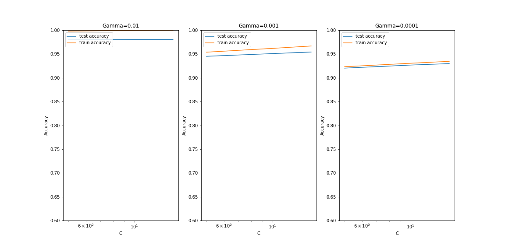

# Unguided, simply permutational performance comparison between NNs and SVMs
## Biola CSCI480 Machine Learning Professor Buzi
## Subin Kim, May 6th, 2020
### Overview
- DATASET  
  The dataset used is keras [MNIST](https://keras.io/datasets/#mnist-database-of-handwritten-digits)  
  It has been divided into S_out 10000 datapoints and S_in 60000 datapoints which is also subsequently divided into S_val 10000 and S_train 50000.  
`(60000, 784) (10000, 784) (50000, 784) (10000, 784)`  
- GOAL  
  The goal of the project is to train the S_train datapoints using 12 iterations of permutations of NN layers and 9 iterations of permutations of SVM parameters to compare their out of sample error of S_out.
- APPROACH
  1. Neural Networks  
    Keras Sequential models will be used. First layer will consist of a Flatten which expands the 2D pixel data of 28x28 into a 1D 784 neural nodes. 2-3 number of Dense layers will be used with varying activation methods ranging from 'relu64', 'relu128', 'selu64', 'selu128', 'tanh64', 'tanh128', 'sigmoid64', 'sigmoid128', 'elu64', 'elu128', 'linear64', 'linear128'. The number behind the activation method indicate the nodes: 64 indicates 2 dense layers, 128 indicate a single dense layer with respective number of nodes.
  2. Support Vector Machines  
    Non linear hyperplane kernel 'rbf' will be constantly used. Parameters: gamma and C will be the control variables which will be determining the optimal combination of values. 10 fold cross validation will be applied to all loop iterations of different SVM parameter combinations. This process takes the average of each chosen 'validation fold' with the remaining 9 training folds for a total of 10 times each loop to take the mean of the accuracy of prediction.
### Results
- NN  
    ```
                    loss  accuracy
    relu64      0.114324    0.9653
    relu128     0.104213    0.9710
    selu64      0.136109    0.9578
    selu128     0.124806    0.9639
    tanh64      0.113714    0.9671
    tanh128     0.106669    0.9669
    sigmoid64   0.159434    0.9519
    sigmoid128  0.149648    0.9551
    elu64       0.120642    0.9647
    elu128      0.120707    0.9643
    linear64    0.358552    0.9025
    linear128   0.291578    0.9194
    ```
- SVM  
    ```
    Fitting 10 folds for each of 9 candidates, totalling 90 fits
    [Parallel(n_jobs=-1)]: Using backend LokyBackend with 8 concurrent workers.
    [Parallel(n_jobs=-1)]: Done  34 tasks      | elapsed: 206.6min
    [Parallel(n_jobs=-1)]: Done  90 out of  90 | elapsed: 455.2min finished
    GridSearchCV(cv=KFold(n_splits=10, random_state=None, shuffle=False),
                error_score=nan,
                estimator=SVC(C=1.0, break_ties=False, cache_size=200,
                            class_weight=None, coef0=0.0,
                            decision_function_shape='ovr', degree=3,
                            gamma='scale', kernel='rbf', max_iter=-1,
                            probability=False, random_state=None, shrinking=True,
                            tol=0.001, verbose=False),
                iid='deprecated', n_jobs=-1,
                param_grid=[{'C': [5, 10, 15], 'gamma': [0.01, 0.001, 0.0001]}],
                pre_dispatch='2*n_jobs', refit=True, return_train_score=True,
                scoring='accuracy', verbose=1)
    ```

    | index | mean_fit_time      | std_fit_time       | mean_score_time    | std_score_time     | param_C | param_gamma | params                     | split0_test_score | split1_test_score | split2_test_score | split3_test_score | split4_test_score | split5_test_score | split6_test_score | split7_test_score | split8_test_score | split9_test_score | mean_test_score    | std_test_score        | rank_test_score | split0_train_score | split1_train_score | split2_train_score | split3_train_score | split4_train_score | split5_train_score | split6_train_score | split7_train_score | split8_train_score | split9_train_score | mean_train_score   | std_train_score        |
    | ----- | ------------------ | ------------------ | ------------------ | ------------------ | ------- | ----------- | -------------------------- | ----------------- | ----------------- | ----------------- | ----------------- | ----------------- | ----------------- | ----------------- | ----------------- | ----------------- | ----------------- | ------------------ | --------------------- | --------------- | ------------------ | ------------------ | ------------------ | ------------------ | ------------------ | ------------------ | ------------------ | ------------------ | ------------------ | ------------------ | ------------------ | ---------------------- |
    | 0     | 967.0997334241868  | 221.481038259063   | 197.92709214687346 | 45.692426798532345 | 5       | 0.01        | {'C': 5, 'gamma': 0.01}    | 0.9832            | 0.9798            | 0.98              | 0.982             | 0.9802            | 0.9798            | 0.979             | 0.9812            | 0.9796            | 0.9728            | 0.97976            | 0.002611972434770313  | 3               | 0.9983777777777778 | 0.9982888888888889 | 0.9981111111111111 | 0.9981333333333333 | 0.9981777777777778 | 0.9983111111111111 | 0.9981333333333333 | 0.9981777777777778 | 0.9981333333333333 | 0.9982444444444445 | 0.9982088888888889 | 8.675209464865504e-05  |
    | 1     | 711.5845452070237  | 28.583200505338766 | 141.55831360816956 | 4.7538508834504105 | 5       | 0.001       | {'C': 5, 'gamma': 0.001}   | 0.9526            | 0.944             | 0.9418            | 0.9498            | 0.9476            | 0.9458            | 0.9416            | 0.946             | 0.946             | 0.937             | 0.94522            | 0.0042013807254282385 | 6               | 0.953              | 0.954              | 0.9537777777777777 | 0.9536666666666667 | 0.9542             | 0.9536222222222223 | 0.9544888888888889 | 0.9539111111111112 | 0.9540222222222222 | 0.9541555555555555 | 0.9538844444444445 | 0.00038487451859241424 |
    | 2     | 1540.7484028816223 | 61.24853380880346  | 244.97226030826567 | 7.632229342593626  | 5       | 0.0001      | {'C': 5, 'gamma': 0.0001}  | 0.9322            | 0.9188            | 0.915             | 0.9256            | 0.9244            | 0.9244            | 0.912             | 0.9222            | 0.9172            | 0.9116            | 0.92034            | 0.006256548569299213  | 9               | 0.9219777777777778 | 0.9230666666666667 | 0.9237555555555556 | 0.9231555555555555 | 0.9232222222222223 | 0.9229555555555555 | 0.9240666666666667 | 0.9232666666666667 | 0.9233333333333333 | 0.9242444444444444 | 0.9233044444444444 | 0.000603123556737223   |
    | 3     | 533.7997627496719  | 20.71812290647703  | 111.44342470169067 | 3.6996022427286204 | 10      | 0.01        | {'C': 10, 'gamma': 0.01}   | 0.983             | 0.9812            | 0.9818            | 0.9828            | 0.9818            | 0.9796            | 0.9788            | 0.9812            | 0.9794            | 0.9738            | 0.98034            | 0.0025582024939398316 | 2               | 0.9995333333333334 | 0.9995333333333334 | 0.9994666666666666 | 0.9995777777777778 | 0.9995333333333334 | 0.9995333333333334 | 0.9994             | 0.9995333333333334 | 0.9995111111111111 | 0.9996222222222222 | 0.9995244444444443 | 5.639367795756763e-05  |
    | 4     | 597.0648272275924  | 21.8818572038403   | 123.77281205654144 | 4.604467213055486  | 10      | 0.001       | {'C': 10, 'gamma': 0.001}  | 0.9584            | 0.9496            | 0.9472            | 0.9544            | 0.9534            | 0.952             | 0.9472            | 0.9508            | 0.9528            | 0.943             | 0.95088            | 0.004135891681366919  | 5               | 0.9614444444444444 | 0.9623111111111111 | 0.9614             | 0.9614444444444444 | 0.9614666666666667 | 0.9623333333333334 | 0.9623111111111111 | 0.9618222222222222 | 0.9620888888888889 | 0.9621111111111111 | 0.9618733333333334 | 0.0003818150285797887  |
    | 5     | 1179.1273729085922 | 40.32900622388952  | 206.96622948646547 | 7.2238332572443245 | 10      | 0.0001      | {'C': 10, 'gamma': 0.0001} | 0.9372            | 0.9252            | 0.922             | 0.932             | 0.9304            | 0.9296            | 0.9192            | 0.9278            | 0.9264            | 0.9182            | 0.9268000000000001 | 0.005607851638551078  | 8               | 0.9295555555555556 | 0.9301555555555555 | 0.9308888888888889 | 0.9303555555555556 | 0.9303555555555556 | 0.9300888888888889 | 0.9314444444444444 | 0.9308             | 0.9306444444444445 | 0.9316             | 0.9305888888888889 | 0.000592150297904703   |
    | 6     | 532.8657281398773  | 19.789863959143574 | 110.97789912223816 | 3.949825825274087  | 15      | 0.01        | {'C': 15, 'gamma': 0.01}   | 0.9828            | 0.9812            | 0.9816            | 0.983             | 0.9816            | 0.9794            | 0.9786            | 0.9816            | 0.9794            | 0.9744            | 0.9803599999999999 | 0.002422890835345235  | 1               | 0.9998444444444444 | 0.9998444444444444 | 0.9998888888888889 | 0.9998666666666667 | 0.9998666666666667 | 0.9998444444444444 | 0.9998444444444444 | 0.9999111111111111 | 0.9998888888888889 | 0.9998222222222222 | 0.9998622222222222 | 2.591534175488736e-05  |
    | 7     | 552.6020257949829  | 19.356747895405405 | 117.00086154937745 | 4.243640648568996  | 15      | 0.001       | {'C': 15, 'gamma': 0.001}  | 0.9604            | 0.9532            | 0.9516            | 0.9588            | 0.9566            | 0.956             | 0.9514            | 0.9536            | 0.9544            | 0.946             | 0.9541999999999999 | 0.003896665240946426  | 4               | 0.9665777777777778 | 0.9672888888888889 | 0.9665777777777778 | 0.9663777777777778 | 0.9664666666666667 | 0.9669111111111112 | 0.9673333333333334 | 0.9671555555555555 | 0.9664444444444444 | 0.9675333333333334 | 0.9668666666666667 | 0.0004086714397642899  |
    | 8     | 955.4750261783599  | 132.59904884938848 | 160.7187686920166  | 53.816893253142936 | 15      | 0.0001      | {'C': 15, 'gamma': 0.0001} | 0.9404            | 0.9294            | 0.924             | 0.9338            | 0.9328            | 0.9328            | 0.9232            | 0.93              | 0.9284            | 0.9234            | 0.9298200000000001 | 0.005164068163763903  | 7               | 0.9339777777777778 | 0.9342             | 0.9348444444444445 | 0.9348             | 0.9341555555555555 | 0.9346222222222222 | 0.9352             | 0.9347111111111112 | 0.9345333333333333 | 0.9357333333333333 | 0.9346777777777777 | 0.000494538068539283   |
    
    [9 rows x 32 columns]
    The best test score is 0.9803599999999999 corresponding to hyperparameters {'C': 15, 'gamma': 0.01}

### Discussion  
  - NN [Reference](https://www.tensorflow.org/guide/keras/train_and_evaluate)
    - Even though I have no actual idea what those activations mean, (I did read the [documentation](https://keras.io/activations/), but it did not change anything significant about the understanding) I will try my best from a general statistical observation standpoint to give feedback about the results. (I mean as mentioned above in the title, this is "Unguided, simply permutational performance comparison")
    - The biggest observation I can make is that there is a general increase in accuracy and a decrease in loss between the number of layers. The 128 denses have a single layer and 64 denses have a double layer. Which I do not understand at all since my understanding is that the more varied the layers the better at reaching a correct solution because it leaves to diversification to gradually curve out the error deviance. Maybe because the number of nodes actually play a higher factor in determining the performance than the number of layers because the double layers have half=64 the single layer's nodes=128.
    - The only other thing that can be observed is that linear activation is, as expectedly, very poor in performance in compared to the other curved ones. This is pretty obvious because as we learned in class, curved ones mean that they are higher in degrees of freedom, therefore creating more space of coverage in dimension.  
  - SVM [Reference](https://www.kaggle.com/nishan192/mnist-digit-recognition-using-svm)
    - Unlike the Neural Network code, which I understand what almost every single line does, I do not understand what is actually happening for the SVM code with high confidence. So I have added a lot of comments about the code of what I think it is doing and how the output reflects the code. The reason I have chosen this reference code is to reduce downtime where I simply sit around for 4 hours waiting for the process to complete and find out that there was an error, only to fix a couple of lines and wait for another 4 hours. This way it ensured that the code at least functions and I get to test the ranges of hyperparameters without having to waste time debugging and waiting. 
    - Increasing the folds exponentially increased the time it took for the process to complete. Therefore, I started with 2 fold tests to find the correct range of C and gamma.
    - GridsearchCV practically is essentially the ultimate pre-packaged method which searches the combinations of given hyperparameters C and gamma in a grid search with cross validation. This allows us from not using the nested for loops going through each iteration of C and gamma arrays. But to be honest, the grid search is practically doing the same nested looping operation.
    - The pandas method Dataframe was used in the NN too which literally makes a framework of data. Based on the dimensions of the given data, the columns and row indexes can be specified to display the data in pretty much excel format.
    - GridsearchCV already has attributes available for us to access, namely: best_score_ and best_params_. This pretty much automatically records the best accuracy and the C and gamma values corresponding to that score. We can also manually find this information from the dataframe object by searching for the rank_test_score=1.
    - Since I am using multiprocessors, I have added the parameter n_jobs=-1 to utilize all 8 concurrent workers to speed up the process. 
    - To my overjoyed surprise, the multiprocessor concurrency proved to be the solution to this time complexity issue. Before, each run would take multiple hours to complete, or worse not complete at all. So I had reduced the training set size to 10000 just so I could see any sort of results. But after finding out that using 8 concurrent workers brought the time of 10 folds CV with N=10000 down to 20 minutes, I am finally confident in running the full dataset of N=50000 with 10 folds because I can approximate it finishing in couple of hours. This creates a matrix of 9 instances with 90 total fits to process. 
    - Final full data fitting actually took 455.2mins. Which is a whopping 7.586hours. Even with 8 processors! Which makes me seriously question what Jack said in class about running the entire thing through *multiple* iterations in couple of hours. Because a single run took this long.
    - As indicated in the results, The best test score is 0.9803599999999999 corresponding to hyperparameters {'C': 15, 'gamma': 0.01}. We cannot pinpoint an optimal combination since the parameter range for C was [5, 10, 15], and gamma as [1e-2, 1e-3, 1e-4], which makes me think that the optimal solution lies greater than C=15 and less than gamma=0.01.
    - This is essentially data snooping where I already have an idea about what combinations of C and gamma would be optimal from the reference. But as Dr. Buzi mentioned in our final meeting, we need to simply display a solid understanding of NN and potentially SVM. And with the time constraints I have currently, I cannot run this another time with different ranges of hyperparameters.
    
    - Since we already know that in lesser epochs, (the reference uses 5 epochs compared to our 10 epochs) the model starts to overfit the training data with gamma=0.01 and C=all ranges. But what we can deduce from this plot trend is that with decreasing gamma, the overall accuracy goes down but training and test data come closer to each other. **What this means is that there is a high bias to where to make an accurate prediction with decreasing gamma.** I can assume that this bias will asymtote out logarithmically around 80% accuracy since we have decreased gamma as such. The value of C is hard to predict since I should have ran the data with higher differences in the C range such as [0.01, 1, 100] to see if it makes any significant changes beyond our plot here.
### General takeaways and challenges
  - Excluding the fact that I do not explicitly understand the mechanisms of the activation methods, I do understand how the NN layers and node values work in classifying the digits of mnist dataset. 
  - SVM was a bigger challenge since I had to read a lot of documentation to even understand what was going on in the reference and try to find out methods to solve the time complexity of running the tests. 
  - To be honest, I was slightly annoyed that every time I wanted to debug the NN code, it would run the epochs every time and I would have to wait. But to my dismay, that was nothing compared to SVMs. My initial attempts to manually set up the nested loops of SVMs proved absolutely hopeless, since the code would just hang there with nothing giving me feed back about the progress. I then added arbitrary print commands to show the progress, but all I realized was that it was going to take days to even complete a single iteration. 
  - So I had to look for a better optimized reference code. This is when I found about the two references of NN and SVM. Thankfully in the SVM reference, it taught me about the GridsearchCV which literally was a packaged version the manual aspect of the code design. It had the built in loop design and appropriately organized the necessary information in accessible attributes and was easily pushed out into a dataframe which could then be exported as csvs and plots.
# Conclusion
  - NN activation models matter very little, but the number of layers and nodes in each layer is what determines the efficacy of the model. 
  - SVM parameters C and gamma have a reciprocal relationship in the efficacy of accuracy. This relationship is not indefinite since there is a sweet spot of gamma < 0.01 and C > 15 where the model does not overfit the training data exclusively and there are no bias or variance in the accuracy. This is because at those hyperparameters, the mean_test_score showed to be 0.97976 when the mean_train_score of 0.9982.
  - Optimally, another run should be conducted with the hyperparameters {gamma:[0.5, 0.6, 0.7, 0.8, 0.9], C:[16, 17, 18, 19, 20]} to find a better spot based on the extrapolated expectations of gammaOpt < 0.01 & COpt > 15, but I do not have time for another 20 hour iteration before submitting this project.